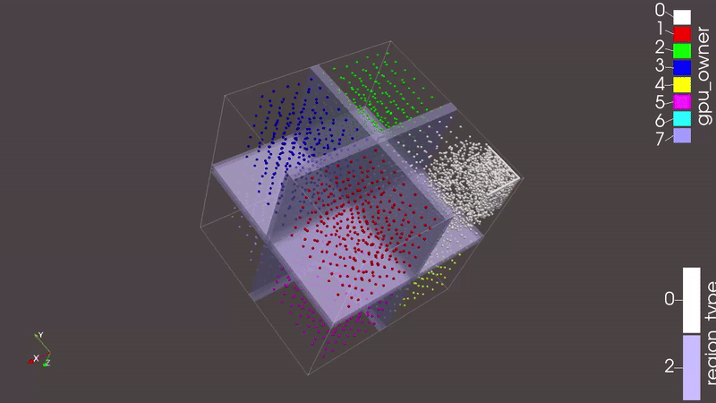

# md3d — Multi-GPU 3D DEM simulator

Spring-dashpot DEM (Discrete Element Method) with **nx×ny×nz grid decomposition**
(factored from N GPUs). Each GPU exchanges halo particles in up to 6 directions
via GPU-side packing + `cudaMemcpyPeer`.

## Demo



## Build

```bash
make
```

### TinyGPU cluster (NHR@FAU)

```bash
# Get a compute node
salloc.tinygpu --gres=gpu:rtx3080:8 --time=01:00:00

# Load modules and build
module load cuda/12.8.0
make
```

Batch submission:
```bash
# Quick test (1 GPU)
sbatch.tinygpu --gres=gpu:1 scripts/bench.sh cube8 5000 1

# Benchmark: see benchmark/BENCHMARK.md for the full runbook
# Flexible script — override GPU count and env vars:
HALO=cpu sbatch.tinygpu --gres=gpu:a100:4 --partition=a100 scripts/bench.sh crossing_freq 50000 4
```

## Run

```bash
./md3d scenes/cube256.json 5000 4 0 0   # vtk_interval=0 → no VTK, bench_interval=0 → summary only
```

Set `vtk_interval=0` to disable VTK output entirely (benchmarks). Set `bench_interval=0`
for final-summary-only (no per-step blocks).

## Algorithm

Per step: **halo exchange** (CPU download/filter/upload by default, GPU packing +
`cudaMemcpyPeer` with `HALO=gpu`) →
**cell assignment** (27-neighbor grid) → **force computation**
(spring-dashpot DEM) → **integration** (symplectic Euler, reflective walls) →
**dynamic rebalancing** (greedy boundary nudging, `DYNAMIC=on`) →
**migration** (GPU-side crossing guard; CPU round-trip by default,
GPU pack+`cudaMemcpyPeer` with `MIGRATE=gpu`).

### Dynamic domain decomposition

When `DYNAMIC=on`, boundaries between GPU domains are nudged by at most one
cell per rebalance interval (default 100 steps) toward the heavier side.
No new GPU kernels — sums `pds[g].n` per column/row/slab on the host and
adjusts `owned_min`/`owned_max` boundaries.  Converges gradually, no
oscillation.  Cell arrays are reallocated if a GPU's `total_cells` exceeds
its pre-allocated capacity.

### Domain decomposition

N GPUs factored into near-cube nx×ny×nz grid:

| GPUs | Grid | Neighbors |
|---|---|---|
| 1 | 1×1×1 | — |
| 2 | 1×1×2 | ±Z |
| 4 | 2×2×1 | ±X, ±Y |
| 6 | 3×2×1 | ±X, ±Y |
| 8 | 2×2×2 | ±X, ±Y, ±Z |

Halo width = `2×r_max`. Edge GPUs have no halo on the domain-wall side.

## Scene format

```json
{
    "dt": 0.0002, "gravity": [0,0,0], "cell_size": 1.0,
    "domain": { "min": [0,0,0], "max": [16,16,16] },
    "particles": [
        { "position": [x,y,z], "velocity": [vx,vy,vz],
          "radius": r, "mass": m, "kn": 1000,
          "gamma_n": 5, "gamma_t": 2.5, "mu": 0.3 }
    ]
}
```

Generate scenes:

```bash
python3 scripts/gen_random3d.py > scenes/my_3d.json
python3 scripts/gen_crossing.py 4 > scenes/crossing_freq.json
```

## Benchmarking

The 5th CLI argument controls benchmark output interval:

```bash
./md3d scenes/cube256.json 5000 4 1000 100
```

Per-step metrics print to stdout every `bench_interval` steps. A CSV is written
to `benchmark/bench_<scene>_<steps>_gpu<N>[_halocpu].csv`. Set `bench_interval=0`
for final-summary-only (no per-step blocks).

Compare two runs:

```bash
python3 scripts/compare_bench.py benchmark/bench_*_gpu1.csv benchmark/bench_*_gpu2.csv
```

## Runtime flags (environment variables)

Toggle algorithm variants without recompiling:

| Variable | Values | Default | Effect |
|---|---|---|---|
| `HALO` | `cpu`, `gpu` | `cpu` | CPU download/filter/upload vs GPU packing + `cudaMemcpyPeer` |
| `MIGRATE` | `cpu`, `gpu` | `cpu` | CPU round-trip vs GPU pack + `cudaMemcpyPeer` |
| `DYNAMIC` | `off`, `on` | `off` | Greedy boundary nudging for load balancing |

Examples:

```bash
# CPU halo + CPU migration (default — no env vars needed)
./md3d scenes/crossing_freq.json 5000 2 10000 100

# GPU halo
HALO=gpu ./md3d scenes/crossing_freq.json 5000 2 10000 100

# GPU migration
MIGRATE=gpu ./md3d scenes/crossing_freq.json 5000 2 10000 100

# Full GPU pipeline (halo + migration both on GPU)
HALO=gpu MIGRATE=gpu ./md3d scenes/crossing_freq.json 5000 2 10000 100

# Dynamic domain rebalancing (every 100 steps, 15% threshold)
DYNAMIC=on ./md3d scenes/comet100k.json 10000 8 0 0

# Compare GPU vs CPU halo
HALO=cpu ./md3d scenes/crossing_freq.json 5000 2 10000 100
HALO=gpu ./md3d scenes/crossing_freq.json 5000 2 10000 100
python3 scripts/compare_bench.py \
  benchmark/bench_crossing_freq_5000_gpu2_*_halocpu_migcpu.csv \
  benchmark/bench_crossing_freq_5000_gpu2_*_halogpu_migcpu.csv
```

## ParaView

1. Download `output/` to your machine
2. `File → Open` → all `.vtk` files + `domain_boundary.vtk`
3. `Glyph` filter → Sphere, scale by `radius`, **Masking → All Points**
4. Color by `gpu_owner` (per-GPU) or `border` (halo gradient)
5. `domain_boundary.vtk`: Coloring → `region_type`, Opacity ~0.3

## Key files

| File | Role |
|---|---|
| `main.cu` | Entry point, simulation loop |
| `domain.h` / `domain.cu` | 3D grid decomposition |
| `halo_exchange.h` / `halo_exchange.cu` | GPU-side packing + `cudaMemcpyPeer` |
| `pack_halo.cuh` / `pack_halo.cu` | Halo pack kernel (atomic-add compaction) |
| `force_kernels.cuh` / `force_kernels.cu` | DEM contact forces |
| `integration.cuh` / `integration.cu` | Symplectic Euler, reflective walls |
| `migration.h` / `migration.cu` | GPU-guarded redistribution (CPU or GPU path) |
| `pack_migrate.cuh` / `pack_migrate.cu` | Crossing-check, pack-migrants, compact-stayers kernels |
| `benchmark.h` / `benchmark.cu` | Per-step timing + CSV output |
| `vtk_output.h` / `vtk_output.cu` | VTK output + domain boundary viz |
| `input.h` / `input.cu` | JSON scene loading |
| `energy_diagnostics.cuh` / `energy_diagnostics.cu` | KE + momentum reduction |
| `scripts/gen_random3d.py` | 3D scene generator |
| `scripts/gen_crossing.py` | Multi-GPU stress scene generator |
| `scripts/sbatch_*.sh` | Slurm batch scripts |

## Cluster hardware

| Partition | GPUs/node | GPU | Interconnect |
|---|---|---|---|
| `a100` | 4× | A100 SXM4 (40 GB) | **NVLink** (600 GB/s) |
| `v100` | 4× | Tesla V100 (32 GB) | **NVLink** (300 GB/s) |
| `rtx3080` | 8× | RTX 3080 (10 GB) | PCIe 3.0 |
| `work` | 4× | RTX 2080 Ti (11 GB) | PCIe 3.0 |

A100 and V100 have NVLink — `cudaMemcpyPeer` runs at GPU-GPU bandwidth
rather than PCIe. Prefer these partitions for multi-GPU scaling benchmarks.
